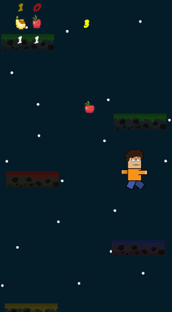

# Chroma Evolve

Chroma Evolve is a 2D game inspired by the classic doodle jump type games. Jump over randomly spawned platforms, collect fruits, and evolve your character. If you fall, you can consume the collected fruits to respawn with an upgraded character, enhancing your abilities and increasing your chances of survival.

<<<<<<< HEAD

=======
>>>>>>> cd3099e7000e3ed1c6d4bc2b448e19d2e7be9cc4
## Table of Contents

- [Overview](#overview)
- [Features](#features)
- [How to Play](#how-to-play)

## Overview

Chroma Evolve provides an exciting and challenging gameplay experience where players must navigate a colorful world of platforms. Evolve your character by collecting fruits and achieve higher scores by jumping higher and avoiding obstacles.

## Features

- Randomly generated platforms for endless gameplay variety.
- Collectible fruits that can be used to upgrade your character upon falling.
- Evolve your character with unique abilities and appearances.
- Simple and intuitive controls for an immersive gaming experience.

## How to Play
- Jumping: Use the arrow keys or on-screen controls to jump from one platform to another.
- Collecting Fruits: Collect fruits while jumping. These fruits can be consumed upon falling to upgrade your character.
<<<<<<< HEAD
- Evolving: Consume the collected fruits upon falling to evolve your character. Each evolution provides unique enhancements.
=======
- Evolving: Consume the collected fruits upon falling to evolve your character. Each evolution provides unique enhancements.
>>>>>>> cd3099e7000e3ed1c6d4bc2b448e19d2e7be9cc4
